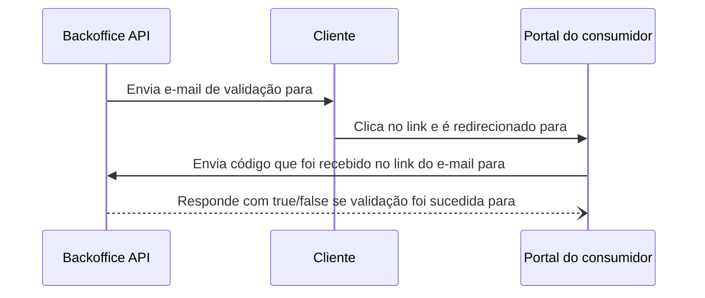

## Requisitos
- Quais perguntas devo fazer?
### Quais são as core features e domínio?
- Quais são as core features?
- Qual é o domínio? 
- Qual é a razão do sistema existir?
### Support features
- Funcionalidades auxiliares que ajudam na solução principal.
- Exemplo: Qual vai ser o gateway de pagamento?
## Estimativa de capacidade

- Quantas requests por segundo?
- Quanto de espaço em disco?
- Quantas compras por dia?
- Quantas visitas por dia?
- Tem picos de acesso?
- Qual o throughput?

## Modelagem de dados

- Qual o tipo de banco de dados?
- Quais os relacionamentos principais?

## API Design

## System Design

- O Desenho

## Exploração

- Por que o kafka?
- Por que ruby?
- Por que não o mysql?
- Por que não um banco NoSQL?
- 





```json
{
	propertyIds: [123, 456, 789, 1011]
}